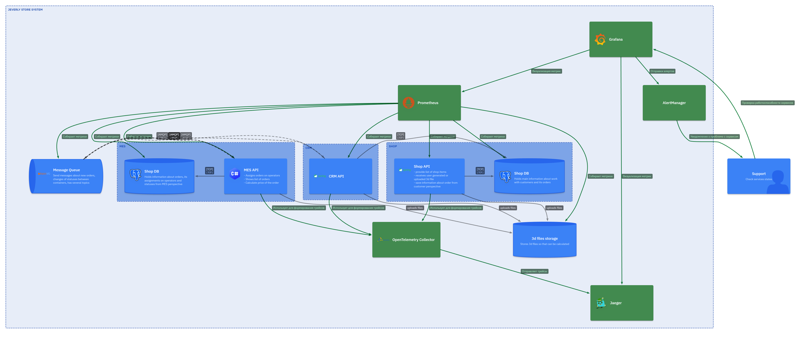
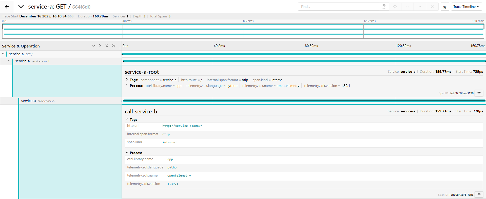

# Задание 3. Трейсинг

Команда видит, что заказы часто находятся в непонятном состоянии или зависают на каком-то сервисе внутри IT-ландшафта. Проблемы с заказами могут появляться и вовсе только потому, что сообщения теряются.

Вам необходимо внедрить инструмент, с помощью которого команда сможет увидеть, что происходило с заказом и где он находится сейчас.

## Что нужно сделать

1. **Создайте в директории Task3 текстовый файл «Архитектурное решение по трейсингу»**. В нём вы будете работать над заданием.
2. **Проанализируйте систему компании и C4-диаграмму в контексте планирования трейсинга**. Напишите и выделите на схеме системы, которые следует покрыть трейсингом. Для этого идентифицируйте места, где заказ может «сломаться» или зависнуть. Составьте список данных, которые должны попадать в трейсинг.
3. **Добавьте в файл раздел «Мотивация»**. Напишите здесь, почему в систему нужно добавить трейсинг и что это даст компании. Опишите возможные три-пять технические и бизнес-метрики решения, на которые повлияет внедрение трейсинга.
4. **Добавьте раздел «Предлагаемое решение»**. Опишите, как и с помощью каких технологий будет реализован трейсинг, какие компоненты нужно внедрить или доработать. Отразите компоненты и новые связи на схеме. Скачайте диаграмму контейнеров «Александрита» в модели C4. Доработайте диаграмму, исходя из вашего решения: отразите на ней новые компоненты и связи. Новые элементы выделяйте красным цветом — так ревьюеру будет проще проверить вашу работу. Когда схема будет готова, добавьте ссылку на неё в раздел «Предлагаемое решение».
5. **Добавьте раздел «Компромиссы»**. Опишите, в каких случаях трейсинг не принесёт пользы или пока невозможен, или его реализация обойдётся слишком дорого. Например, сложно заставить проприетарную систему отдавать метрики в нужном формате, может потребоваться дорогостоящая доработка.
6. **Проработайте аспекты безопасности**. Опишите, какие меры для предотвращения несанкционированного доступа будут предусмотрены для системы трейсинга внутри компании и снаружи если это требуется. Например: «Внедрение аутентификации — зайти в систему смогут только сотрудники компании с актуальной учетной записью и ролью “Поддержка”».
7. **Дополнительное задание**. Спроектируйте и опишите в разделе «Предлагаемое решение», как будет реализованы автоматический мониторинг процесса прохождения заказа, полученные из данных трейсинга, и алертинг. Обновите последний вариант диаграммы, который вы подготовили для этого раздела, — отразите на нём необходимые связи. Новые элементы выделяйте зелёным цветом. Добавьте отдельную ссылку на новый вариант диаграммы.

## Отчёт


### Использвание трейсинга

Трейсинг должен покрывать весь жизненный цикл заказа, включая синхронные HTTP‑вызовы и асинхронный обмен через RabbitMQ.

Критичные участки, где заказ может «сломаться» или зависнуть:

- Онлайн‑магазин:
  - Создание/изменение заказа: `INITIATED` → `FILE_UPLOADED` → `SUBMITTED`.
  - Вызовы к MES/CRM (если есть прямые интеграции).

- MES:
  - Получение 3D‑модели и постановка расчёта цены.
  - Длительная фоновая обработка 3D‑модели и расчёт стоимости (`PRICE_CALCULATED`).
  - Переходы `MANUFACTURING_STARTED` → `MANUFACTURING_COMPLETED` → `PACKAGING` → `SHIPPED`.
  - Публикация/чтение сообщений в RabbitMQ.

- CRM:
  - Получение заказа от MES/B2B.
  - `MANUFACTURING_APPROVED` и `CLOSED`, реакции на сообщения от MES и транспортной компании.

- RabbitMQ
  - Все очереди, по которым проходят события заказа.

- B2B‑API (внешние партнёры)
  - Приём/ответ на запросы партнёров, публикация сообщений в RabbitMQ/CRM/MES.


#### Список данных для трейсинга

Для каждого заказа и операции нужно фиксировать:

- **Глобальные идентификаторы:**
  - `trace_id` — сквозной идентификатор трейсинга для одного «пути» заказа.
  - `span_id` — идентификатор конкретной операции.
  - `order_id` (внутренний ID заказа) и, при наличии, `external_order_id` (ID у B2B‑партнёра).
  - `message_id` (ID сообщения в RabbitMQ, corr_id, delivery_tag и т. п.).

- **Контекст и причинно‑следственные связи:**
  - Родительский `span_id` (кто инициировал операцию).
  - Тип события/операции: `event_type` (order_created, price_calculation_started, status_update:MANUFACTURING_STARTED и т. д.).
  - Источник и получатель: `source_system` (shop, mes, crm, b2b_partner_X), `destination_system`.

- **Временные характеристики:**
  - Время начала и завершения span’а.
  - Длительность операции (запроса, обработки в воркере, пребывания в очереди).

- **Технические атрибуты:**
  - HTTP‑метод и URI / RPC‑метод, HTTP‑статус.
  - Имя очереди и exchange в RabbitMQ, routing_key.
  - Размер полезной нагрузки (например, объём 3D‑модели, размер сообщения).

- **Результат и ошибки:**
  - Статус операции (success/fail/retry).
  - Коды ошибок, тип ошибки (validation, timeout, external_dependency, internal_exception).

- **Бизнес‑атрибуты (для аналитики):**
  - Канал: `channel` (web, api_partner).
  - Партнёр: `partner_id`.
  - Тип изделия / сложность модели (если есть классификация).


### Мотивация

Сейчас команда не может быстро ответить на базовые вопросы: «Где висит заказ?», «Терялись ли сообщения?», «Кто последний менял статус?». Это приводит к долгим расследованиям, кручению логов руками и, как следствие, к затянутым инцидентам и потере доверия клиентов и партнёров.

Внедрение распределённого трейсинга даст:

- **Сквозную видимость пути заказа**: от INITIATED на сайте и/или через B2B‑API до CLOSED, c отображением всех hops через MES, CRM и очереди RabbitMQ.
- **Сокращение MTTR и упрощение root cause analysis**: по trace за минуты можно увидеть, на каком шаге и в какой системе заказ «сломался» или застрял (например, завис в очереди, не дошёл до CRM, не обновился статус в MES).

Технические и бизнес‑метрики, на которые влияет трейсинг:

- **Технические:**
  - MTTR (mean time to repair) инцидентов по заказам — ожидание, что он существенно сократится.
  - Доля «потерянных»/рассинхронизированных заказов (обнаруживаются быстрее за счёт сравнения трейсинга и статусов).
  - Доля инцидентов, для которых успешно определён корень проблемы (RCA coverage).

- **Бизнес‑метрики:**
  - Количество просроченных заказов, связанных с IT‑проблемами (можно отделить от проблем логистики/производства).
  - Сохранённые B2B‑контракты и удовлетворённость партнёров (SLA по ответам, скорость расследований инцидентов).
  - Уменьшение нагрузки на первую линию поддержки за счёт self‑service поиска пути заказа по его ID.


### Предлагаемое решение

#### Подход и технологии

- **Стек трейсинга: OpenTelemetry + OTLP‑совместимый бекенд (Jaeger/Tempo/SigNoz и т. п.)**
  - OpenTelemetry SDK для Java Spring Boot (онлайн‑магазин и CRM).
  - OpenTelemetry .NET SDK для C#‑бэкенда MES.

- **Принципы:**
  - Сквозной `trace_id` создаётся при первом контакте с заказом (INITIATED через сайт или первый B2B‑запрос) и далее передаётся в HTTP‑заголовках и заголовках сообщений RabbitMQ (например, `traceparent`, `baggage`, `X-Trace-Id`).
  - Для каждого значимого шага в жизненном цикле заказа создаётся span с бизнес‑атрибутами (`order_id`, `status_from`, `status_to`, `channel`, `partner_id`).

- **Интеграция с существующим мониторингом:**
  - Бекенд трейсинга подключается к уже выбранной time‑series/мониторинговой системе (например, Prometheus + Grafana + Jaeger/Tempo в одном стеке).
  - Из трейсинга автоматически считаются и аггрегируются производные метрики.

#### Компоненты и доработки диаграммы C4

Изменения на контейнерной диаграмме:

1. **Jaeger** - сбор трейсов.
2. **Prometheus** - сбор метрик.
3. **Grafana** - построение дашбордов, алертинг об инцидентах.
4. **Компонент «OpenTelemetry Collector** - принимает OTLP от всех приложений, нормализующий и пересылающий данные в бекенд.
5. **Доработки для приложений** - для каждого API добавляется трейсинг запросов + добавляется сбор метрик



### Компромиссы

- **Производительность и стоимость хранения**
  - Полный трейсинг всех запросов и всех спанов по длительным расчётам и тяжёлым очередям может заметно увеличить накладные расходы и стоимость хранения данных.
  - Придётся вводить сэмплинг (например, 10–20% трасс), ограничение по глубине/длительности и политики retention (например, хранить детальные трейсы 7–14 дней, агрегированные метрики дольше).

- **Проприетарные или сложно модифицируемые компоненты**
  - Если в будущем появятся внешние/закрытые системы (например, сторонняя логистика, платёжные шлюзы), не всегда возможно встроить туда OpenTelemetry или управлять их span’ами; придётся работать через «краевые» спаны и лог‑корреляцию.

- **Сложность внедрения и обучения команды**
  - Потребуется время на интеграцию во все сервисы (Java, C#, фронтенды, RabbitMQ), на настройку корреляции по trace_id и обучение разработчиков/поддержки работе с инструментом.
  - Без изменения процессов выгода от системы будет ограниченной.

- **Безопасность и конфиденциальность**
  - В trace могут попасть чувствительные данные (личные данные клиента, адрес, телефон, детали B2B‑контрактов). Придётся маскировать или не логировать такие поля, иначе система трейсинга станет дополнительным риском.


### Безопасность трейсинга

- **Аутентификация и авторизация в UI трейсинга**
  - Доступ только по корпоративной SSO/IAM (например, OAuth2/OIDC, интеграция с существующей учёткой).
  - Выделить роль «Поддержка» / «SRE/DevOps» / «Разработчик» - доступ к интерфейсу и данным трейсинга только для сотрудников с этими ролями.

- **Ролевое разграничение**
  - Операторам и продавцам трейсинг напрямую не доступен - для них строятся отдельные дашборды/отчёты без детальных технических данных.
  - Отдельные права на просмотр/изменение конфигурации трейсинга.

- **Защита данных и трафика**
  - Трафик OTLP между сервисами и бекендом трейсинга шифруется (TLS), доступ по VPN/приватной сети.
  - Маскирование/удаление чувствительных полей (PII, финансовые данные) на уровне библиотеки кода — в трейсах допускаются только минимально необходимые данные.

- **Аудит доступа**
  - Логирование входов в систему трейсинга и ключевых действий (поиск по конкретным заказам, выгрузка отчётов) для последующего аудита.


## Задание 3.1. Трейсинг с OpenTelemetry и Jaeger

Команда, помимо реализации быстрых улучшений планирует реализовать разворачивание сервисов в Kubernetes, что позволит оптимальней реагировать на нагрузку в будущем. Поэтому необходимо собрать MVP c несколькими сервисами и трассировкой.

В [репозитории](https://github.com/Yandex-Practicum/architecture-alexandrite-k8s-trace) находятся подготовленные DevOps специалистом конфигурации для запуска Jaeger в папке k8s.

### Что нужно сделать

В файле README.md описаны необходимые шаги для запуска:

1. Скопируйте конфигурации к себе в репозиторий Task3.
2. Разработайте два сервиса, например сервис расчёта и сервис заказов на любом языке программирования.
3. У каждого сервиса должно быть по одному REST API методу, например GET.
4. Добавьте работу с OpenTelemetry SDK в свои сервисы, чтобы при вызове первого сервиса он вызывал второй, и этот вызов целиком попадал в один трейс.
5. Сделайте вызов, например так:
  ```bash
  # Вызов service-a, который вызывает service-b
  kubectl exec -it $(kubectl get pods -l app=service-a -o jsonpath='{.items\[0\].metadata.name}') -- wget -qO- http://service-a:8080
  ```
6. Откройте Jaeger UI:
  ```bash
  kubectl port-forward svc/simplest-query 16686:16686
  ```

  Откройте в браузере: http://localhost:16686.

  Найдите свой трейс и сделайте скриншот.

7. Добавьте скриншот в папку с третьим заданием.


