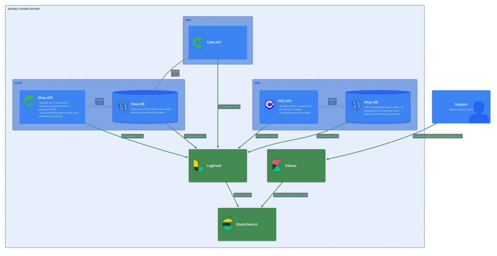

# Задание 4. Логирование

Сейчас ошибки или нестандартные ситуации разбираются со слов клиента: клиенты рассказывают, как что-то пошло не так. Чтобы понять, что случилось на стороне сервиса, разработчикам и специалистам поддержки требуется очень много времени.

Нужно найти системное решение, которое упростит разбор проблем внутри сервисов и снизит нагрузку поддержки.

## Что нужно сделать

1. **Создайте в директории Task4 файл «Архитектурное решение по логированию»**. Здесь вы будете работать над заданием.
2. **Проанализируйте систему компании и C4-диаграмму в контексте планирования логирования**. Опишите, какие логи нужно собирать, и отметьте на схеме, из каких систем требуется сбор логов. Составьте список необходимых логов с уровнем INFO. Например, изменение статуса заказа: логируем время, идентификатор покупателя, номер заказа. Напишите, будете ли вы использовать другие уровни логирования и при каких обстоятельствах
3. **Добавьте в файл раздел «Мотивация»**. Напишите здесь, почему в систему нужно добавить логирование и что это даст компании. Опишите три-пять технические и бизнес-метрики решения, на которые может повлиять внедрение логирования. Команда не сможет реализовать единовременно логирование и трейсинг всех выделенных для этого систем. Поэтому опишите, для каких систем нужно настраивать логирование и трейсинг в первую очередь и почему.
4. **Добавьте раздел «Предлагаемое решение».** Опишите, как и с помощью каких технологий будет реализовано логирование, какие компоненты нужно внедрить или доработать. Отразите компоненты и новые связи на схеме. Проработайте политику безопасности в отношении логов — как будет происходить работа с чувствительными данными, кто будет иметь доступ к логам. Проработайте политику хранения в отношении логов — будет ли это отдельный индекс под систему, сколько они будут храниться и какого размера будут.
5. **Проработайте необходимые мероприятия для превращения системы сбора логов в систему анализа логов**: Нужно ли настроить какой-то алертинг? Нужно ли искать аномалии? Например, было четыре записи о создании заказов и за секунду их стало 10 000. Возможно, происходит DDoS-атака конкурентами.
6. **Дополнительное задание**. Проработайте критерии для выбора технологии для работы с логами и обоснуйте свой выбор через плюсы и минусы. Выделите не менее пяти критериев. Пример:

| Критерий | ELK             | OpenSearch                  | Splunk        | Что-то ещё |
| -------- | --------------- | --------------------------- | ------------- | ---------- |
| Лицензия | Elastic License | Apache License, Version 2.0 | Проприетарная |            |

## Отчёт

### Какие системы и логи нужны

Логирование должно быть централизованным и покрывать все backend‑компоненты и интеграции, чтобы по логам можно было восстановить историю любого заказа и быстро понять, где он «сломался».

Системы, из которых обязательно собирать логи:

- Онлайн‑магазин, CRM, MES.
- RabbitMQ (лог брокера + события по очередям).
- Базы данных (как минимум — ошибки подключения и долгие запросы).

#### Список ключевых логов уровня INFO

Для всех сервисов (единый формат JSON‑логов):

Общие поля: `timestamp`, `level`, `service`, `environment`, `order_id` (если есть), `trace_id`/`request_id`, `user_id`/`partner_id`, `message`.

Примеры событий INFO:

- Онлайн‑магазин:
  - Создание/изменение заказа:
    - `ORDER_CREATED`: время, `order_id`, `user_id`, `channel=web`, сумма (без деталей оплаты), базовые атрибуты (готовое/кастом).
    - `ORDER_UPDATED`: изменение корзины до SUBMITTED.
  - Переход статусов:
    - `STATUS_CHANGED`: `order_id`, `status_from`, `status_to`, инициатор (пользователь/система).
  - Вызовы к внешним системам (MES/CRM/B2B) — короткие логи:
    - `OUTBOUND_REQUEST`: `order_id`, `target_system`, `endpoint`, `status_code`, `duration_ms`.

- CRM:
  - Создание заказа из очереди / API:
    - `ORDER_IMPORTED_FROM_QUEUE`: `order_id`, `source_system`, `message_id`.
  - MANUFACTURING_APPROVED и CLOSED:
    - `STATUS_CHANGED` с дополнительными полями: причина закрытия (успех/отмена/ручное).

- MES:
  - Старт/окончание расчёта цены:
    - `PRICE_CALCULATION_STARTED`: `order_id`, тип изделия, параметры сложности.
    - `PRICE_CALCULATION_FINISHED`: `order_id`, `duration_ms`, результат (успех/ошибка, краткая причина).
  - Взятие заказа в работу оператором и статусы производства:
    - `OPERATOR_ASSIGNED`: `order_id`, `operator_id`.
    - `STATUS_CHANGED` для производственных статусов.

- RabbitMQ:
  - Публикация и потребление сообщений по ключевым топикам:
    - `MESSAGE_PUBLISHED`: `message_id`, `order_id`, `exchange`, `routing_key`, `queue`.
    - `MESSAGE_CONSUMED`: `message_id`, `order_id`, `consumer_service`, результат (успех/retry/DLQ).
  - Перемещение в DLQ:
    - `MESSAGE_DEAD_LETTERED`: `message_id`, `order_id`, причина (reject, TTL, routing_error).

- B2B‑API:
  - Приём запросов партнёров:
    - `B2B_ORDER_SUBMITTED`: `external_order_id`, `order_id` (если уже создан), `partner_id`, `status_code`, `duration_ms`.

#### Другие уровни логирования

Используем стандартные уровни: DEBUG, INFO, WARN, ERROR, FATAL/CRITICAL.

- **DEBUG**
  - Подробные детали внутренней логики, входные/выходные структуры и т. п.
  - Включается точечно (per‑service/per‑feature) в dev/release, в prod — по временным флагам во время расследования.

- **INFO**
  - Нормальный ход бизнес‑процессов (как описано выше).
  - Основной уровень в проде.

- **WARN**
  - Аномалии, не приводящие сразу к сбою(повторные ретраи, временная деградация внешнего сервиса, превышение мягкого лимита времени, подозрение на дубликаты заказов).

- **ERROR**
  - Ошибки, когда операция не выполнена:
    - исключения при обработке заказа, фатальные ошибки в интеграциях, падения воркеров, потеря сообщений (если обнаружена).
  - Логи ERROR должны включать стек трейса и контекст (`order_id`, `trace_id`).

- **FATAL/CRITICAL**
  - Неподнимаемые состояния приложения (невозможность стартовать, потеря критической конфигурации).
  - Должны почти всегда сопровождаться алертом.

### Мотивация

Сейчас инциденты разбираются по рассказам клиентов, а не по объективным данным, в результате расследования занимают часы и дни, а некоторые причины остаются неизвестными. Централизованное структурированное логирование даёт:

- Быструю реконструкцию событий вокруг заказа (что делала каждая система, какие сообщения отправлялись/читались).
- Снижение нагрузки на поддержку: они могут искать лог по `order_id`/`external_order_id` и иметь готовый ответ клиенту.
- Основание для автоматизированного алертинга по аномалиям и сбоям.

Технические и бизнес‑метрики, на которые влияет логирование:

- **Технические:**
  - MTTR по инцидентам (должен сократиться).
  - Количество инцидентов с «неопределённой причиной» (должно уменьшиться).
  - Доля ошибок, обнаруженных автоматически (по логам/алертам), а не по жалобам.

- **Бизнес:**
  - Время ответа поддержки клиенту по проблемному заказу.
  - Количество потерянных B2B‑контрактов из‑за «пропавших»/зависших заказов.
  - Нагрузка на первую линию поддержки (количество обращений, эскалаций).

### Приоритет: где сначала логирование, где сначала трейсинг

Ограничения команды означают, что нужно расставить приоритеты:

1. **MES и очереди RabbitMQ** - Здесь концентрируются расчёт стоимости, статусы производства и интеграции с B2B.
   - Сначала — подробное структурированное логирование (включая DLQ, ретраи и ошибки обработки сообщений).
   - Параллельно — базовый трейсинг по ключевым цепочкам расчёта и статусов (чтобы иметь сквозной контекст).

2. **CRM** - Ответственна за MANUFACTURING_APPROVED и CLOSED, часто оказывается «бутылочным горлышком».
   - Сначала — логирование импортов заказов и статусов;
   - Затем трейсинг вокруг статусов и интеграций.

3. **B2B‑API и онлайн‑магазин**
   - На старте достаточно хорошего логирования запросов/ответов и бизнес‑событий (создание/подтверждение заказа).
   - Расширенный трейсинг можно внедрять после стабилизации ядра (MES/CRM/RabbitMQ).

* Логирование внедряется во всех указанных сервисах с самого начала.
* Трейсинг — глубже и раньше в MES+RabbitMQ+CRM, где больше всего сложных асинхронных сценариев.

### Предлагаемое решение

#### Технологии и компоненты

- **Формат логов и принципы**
  - Структурированные логи в JSON со стандартным набором полей (`timestamp`, `level`, `service`, `environment`, `trace_id`, `order_id`, `user_id`/`partner_id`, `message`, `event_type`).
  - Логи выводятся в stdout/stderr контейнеров/EC2, далее собираются агентами.

- **Централизованный сбор и хранение**
  - Агент/шиппер: Fluent Bit / Fluentd / Logstash / Vector на каждом инстансе.
  - Хранилище и анализ:
    - Вариант 1: **ELK (Elasticsearch + Logstash + Kibana)**.
    - Вариант 2: **OpenSearch + OpenSearch Dashboards** (open‑source, хорошо подходит для облака).
    - Вариант 3: коммерческий SaaS (Splunk, Datadog, пр.) — дороже, но меньше операционных затрат.

- **Интеграция с трейсингом**
  - Логи должны включать `trace_id`/`span_id` из OpenTelemetry, чтобы можно было переходить от трейса к логам и обратно.

На диаграмме C4:

#### Политика безопасности для логов

- **Чувствительные данные**
  - Не логировать: полные ФИО, телефоны, адреса, email, платёжные реквизиты, токены, JWT.
  - Маскирование: частично маскировать идентификаторы, если они попадают в логи (например, показывать только часть телефона/email).
  - Ввести статический и динамический анализ лог‑событий на предмет PII (регулярки/фильтры в шиппере).

- **Доступ к логам**
  - Аутентификация через корпоративный SSO/IAM к Kibana.
  - Ролевое разграничение:
    - Разработчики и SRE/DevOps — полный доступ к техническим индексам.
    - Поддержка — доступ только к бизнес‑ориентированным индексам/дашбордам (без внутренних стек‑трейсов и конфиденциальных фрагментов).
    - Жёсткий контроль прав на экспорт и массовую выгрузку логов.

- **Шифрование и сетевой контур**
  - TLS для доступа к лог‑бекенду, закрытый сетевой периметр.
  - Аудит действий пользователей в системе логов.

#### Политика хранения

- **Отдельные индексы/пространства имён**
  - Разделение по системам и типам логов:
    - `logs-shop-app-*`, `logs-crm-app-*`, `logs-mes-app-*`, `logs-rabbitmq-*`, `logs-db-*`.
    - Можно дополнительно разбивать по уровню (`logs-*-error`, `logs-*-info`) или по окружениям.

- **Retention и размер**
  - Примерная политика:
    - ERROR/WARN‑логи и бизнес‑события: хранить 90–180 дней.
    - INFO‑логи общего характера: 14–30 дней.
    - DEBUG — только временно/эпизодически, с минимальным retention (1–7 дней).
  - Шардирование и lifecycle‑политики (теплые/холодные узлы, архивы в объектное хранилище) для контроля стоимости.

### От логов к анализу: алертинг и аномалии

Чтобы система логов была именно системой анализа, нужны:

1. **Алертинг по логам**
   - Правила на ERROR/FATAL:
     - всплеск ERROR‑логов в MES/CRM по заказам (например, > N ошибок за 5 минут) → инцидент.
     - повторяющиеся ошибки в интеграциях с RabbitMQ/B2B‑API.
   - Правила по бизнес‑событиям:
     - длительное отсутствие `PRICE_CALCULATION_FINISHED` для заказов со статусом SUBMITTED → возможное зависание расчёта.
     - массовое накопление `MESSAGE_DEAD_LETTERED` в очередях.

2. **Поиск аномалий**
   - Правила и/или ML‑анализ по количеству событий:
     - резкий скачок `ORDER_CREATED` или B2B запросов (в N раз больше среднего за минуту/час) → возможный DDoS/баг партнёра;
     - резкое падение числа успешных заказов при стабильном трафике → скрытая ошибка.

3. **Дашборды для анализа**
   - Готовые сохранённые запросы и визуализации:
     - «Все события по order_id / external_order_id».
     - «Ошибки по MES за последний час с разбивкой по типу».
     - «Очереди RabbitMQ: DLQ‑события и ретраи».

### Дополнительное задание: критерии выбора технологии логов

| Критерий                            | ELK (Elasticsearch + Logstash + Kibana) | OpenSearch + Dashboards               | Splunk                                | Что‑то ещё (например, Loki, SaaS) |
|-------------------------------------|-----------------------------------------|---------------------------------------|---------------------------------------|-----------------------------------|
| Лицензия                            | Elastic License / частично OSS          | Apache License 2.0    | Проприетарная        | Зависит от решения                |
| Стоимость владения                  | Низкая лицензия, но свои ресурсы и DevOps‑затраты  | Open‑source, хорошо интегрируется с облаками, схожие затраты на DevOps  | Высокая стоимость лицензий, но меньше опер‑затрат  | Варьируется                       |
| Масштабируемость и производительность | Высокая, но требует грамотного тюнинга и шардирования  | Схожая с Elasticsearch, заточена под облако и масштабирование  | Очень высокая, mature‑решение для крупных инсталляций  | Зависит от конкретного решения   |
| Удобство эксплуатации в облаке     | Есть managed‑варианты, но не всегда в нужном облаке  | Есть готовые reference‑архитектуры и managed‑сервисы  | SaaS/managed, минимум инфраструктурных забот  | Зависит                           |
| Интеграция с экосистемой (агенты, плагины, алертинг) | Богатая экосистема, много готовых агентов и дашбордов  | Совместима с большинством инструментов ELK, богатеющая экосистема  | Глубокая интеграция, развитая аналитика и алертинг  | По ситуации                       |
| Безопасность и контроль доступа    | Гранулярные роли, но часть функций в коммерческой версии  | Ролевой доступ, open‑source плагины  | Сильная корпоративная безопасность, аудит  | Зависит                           |
