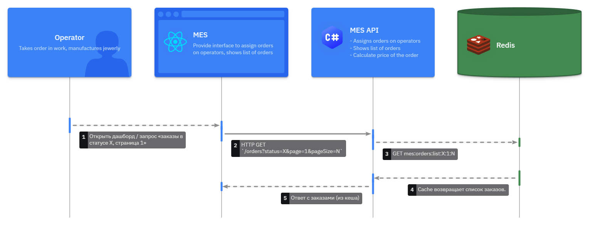
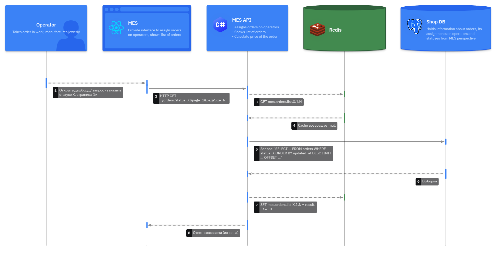
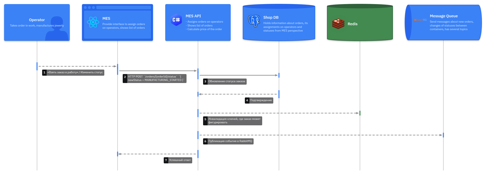

# Задание 5. Кеширование

Итак, MES чувствует себя не очень хорошо. Операторы жалуются на низкую скорость работы со страницей, а новых клиентов не устраивает скорость выполнения заказа. Руководство «Александрита» просит вас разобраться с проблемой.

Вам нужно подготовить документ с описанием вашего архитектурного решения. Он поможет вам объяснить бизнесу и разработчикам, что нужно сделать, чтобы решить проблему.

В процессе разработки команда будет использовать артефакт как справочный документ. К таким документам удобно обращаться, если нужно понять, почему было принято то или иное решение.

## Что нужно сделать

1. **Создайте в папке Task5 текстовый файл «Архитектурное решение по кешированию»**. Здесь вы будете работать над заданием.
2. **Проанализируйте диаграмму системы и её описание**. Решите, какую часть системы имеет смысл закешировать.
3. **Добавьте в файл раздел «Мотивация»**. Опишите здесь, почему вы предлагаете внедрить кеширование, какие проблемы оно должно решить и какие элементы системы вы планируете включить в кеширование.
4. **Добавьте раздел «Предлагаемое решение»**. Определите, какое кеширование вы будете внедрять — клиентское или серверное. Объясните, почему, на ваш взгляд, нужно использовать именно его. Если вы решите куда-то внедрить серверное кеширование, то поясните, какой паттерн будете применять — Cache-Aside, Write-Through или Refresh-Ahead. А также объясните, почему вы выбрали этот паттерн и почему остальные паттерны не подойдут или покажут себя хуже.
5. **Нарисуйте диаграмму последовательности действий (Sequence diagram)**. Отобразите там, как проходит операция чтения списка заказов и запись об изменении статуса заказа. Там же опишите процесс кеширования с указанием всех сущностей, которые участвуют в кешировании. Добавьте диаграмму в раздел «Предлагаемое решение».
6. **В блоке «Предлагаемое решение» опишите стратегию инвалидации кеша, которую вы планируете использовать**. Объясните, какую стратегию инвалидации вы предлагаете (временную, по ключу, программную или другие), почему она подойдёт и почему не подойдут другие стратегии. Не всегда очевидно, какое решение лучше. Чтобы выбрать оптимальный вариант, можете сделать сравнительный анализ в виде таблицы.
7. **Дополнительное задание**. Если вы считаете, что может быть несколько решений и вам сложно выбрать между ними, можете описать несколько вариантов. В таком случае в разделе «Предлагаемое решение» запишите как минимум два решения и подготовьте сопоставление в виде таблицы. После таблицы сделайте заключение. Опишите, какое решение, на ваш взгляд, подходит больше и почему.

## Отчёт

### Мотивация

MES страдает от двух ключевых проблем:

- долгие ответы при открытии первой страницы операторов (список заказов с фильтрами и пагинацией);
- высокая латентность жизненного цикла заказа (в том числе из‑за тяжёлых операций расчёта и частых обращений к БД/MES API).

Кеширование должно:

- снизить нагрузку на БД MES и ускорить работу дашборда операторов (чтение «свежих заказов в работе»);
- уменьшить время ответа MES API для часто читаемых данных, не изменяющихся каждую секунду;
- дать предсказуемое время ответа даже при росте числа заказов.

Элементы, которые планируется кешировать:

- список «последних/активных заказов» по статусам для дашборда операторов (read‑heavy, обновляется событиями статусов, но не каждую миллисекунду);
- агрегированные/предрасчитанные представления (CQRS‑стиль) для быстрых выборок: например, «заказы в статусах `MANUFACTURING_STARTED / PACKAGING / PRICE_CALCULATED`» с сортировкой по времени создания/изменения;
- справочники и относительно статичные данные в MES/CRM (типы изделий, настройки производства и т. д.).

Расчёт стоимости 3D‑модели как таковой — CPU‑ёмкая операция, но кешировать конкретные результаты имеет смысл точечно и отдельно (по хешу 3D‑модели); это можно вынести как вторую очередь инициатив, а сейчас сосредоточиться на дашборде операторов.

### Предлагаемое решение

#### Тип кеширования и паттерн

Основной упор — **серверное кеширование**:

- **Клиентское кеширование** (HTTP‑кеш на фронтенде, браузерный кеш) мало помогает, потому что:
  - операторам нужно видеть актуальные новые заказы, т.к. от этого зависит их вознаграждение;
  - данные должны быть консистентны для всех операторов (shared view), а не локально в браузере.

- **Серверный кеш** позволяет:
  - иметь общее кэшированное представление «активных заказов»;
  - гибко управлять инвалидацией по событиям и TTL;
  - разгрузить БД MES.

Для кеша дашборда выбирается **Cache-Aside (lazy loading)** с элементами **event‑based инвалидации по ключу**, т.к.:

- **Cache-Aside** хорошо подходит для read‑heavy сценариев, где данные можно безопасно брать из БД при кэш‑миссе, а обновления происходят «обычным путём» в БД.
- **Write-Through** усложнит и замедлит все операции записи статусов (любое изменение будет писать и в БД, и в кеш синхронно), что критично для MES, где есть много статусов и фоновых операций.
- **Refresh-Ahead** усложняет реализацию и даёт выигрыш при очень предсказуемых и часто повторяющихся запросах к одному и тому же ключу; для списка «самых свежих заказов», где набор ключей постоянно меняется, польза меньшая, чем сложность и накладные расходы.

Для потенциального кеширования результатов расчёта цены на сложные 3D‑модели можно позже рассмотреть сочетание Cache-Aside + Refresh-Ahead (если часто пересчитывается цена для одинаковых моделей).

#### Где и как кешируем (MES дашборд)

**Цель:** ускорить операцию «получить список последних/активных заказов по статусу» для операторов MES.

Стек (пример):

- Redis как внешний in‑memory кеш;
- C#‑бэкенд MES использует библиотеку‑обёртку (клиент Redis) и реализует паттерн Cache-Aside.

Ключи кеша:

- `mes:orders:list:{status}:{page}:{pageSize}` — список order_id (и краткая инфа) для дашборда;
- TTL для таких ключей — небольшая (например, 5–15 секунд), плюс программная инвалидация по событиям изменения статуса.

Данные в кеше:

- для каждого списка — только «тонкое» представление: `order_id`, текущий статус, время последнего изменения, оператор (если есть), краткие атрибуты;
- если нужны детали, фронтенд/бэкенд делает отдельным запросом (который также можно кешировать отдельным ключом `mes:order:details:{order_id}` с более длинным TTL).

#### Диаграмма последовательности

**Чтение списка заказов (Cache-Aside):**

Альтернатива A — **кеш‑хит**:

Альтернатива B — **кеш‑мисс**:

**Изменение статуса заказа (инвалидация по ключу):**

Участники: `Operator`, `MES_UI`, `MES_Backend`, `MES_DB`, `Cache (Redis)`, (опционально) `CRM/RabbitMQ`.

#### Стратегия инвалидации кеша

Используется сочетание:

- **инвалидация по ключу (event‑based)** — при изменении статуса заказа, который может повлиять на списки;
- **временная (TTL)** — чтобы ограничить срок жизни каждого списка и избежать долгого накопления рассинхрона.

#### Таблица сравнения стратегий инвалидации

| Стратегия                | Плюсы                                              | Минусы / особенности                                     | Почему подходит / не подходит для MES дашборда |
|--------------------------|----------------------------------------------------|----------------------------------------------------------|-----------------------------------------------|
| Временная (TTL only)     | Простая реализация, не требует учёта событий  | Возможна заметно устаревшая информация до истечения TTL; выбор TTL — компромисс между свежестью и нагрузкой  | В одиночку не подходит: операторам нужна почти актуальная картина |
| По ключу (event-based)   | Точные инвалидации сразу после изменения данных  | Сложнее реализовать, нужно знать, какие ключи затронуты; возможны пропуски при сбоях  | Хорошо подходит, если дополняется TTL как «страховкой» |
| Программная/ручная (админские очистки, кнопки) | Гибкий ручной контроль, полезно для аварий и редких кейсов | Непригодна как основная стратегия; человеческий фактор | Используется дополнительно, но не как основная |
| Смешанная (TTL + по ключу) | Баланс между свежестью и устойчивостью, авто‑очистка  | Чуть более сложная реализация и конфигурация TTL | Оптимальный выбор для списка заказов MES |

### Варианты решений (дополнительно)

Если нужно явно рассмотреть несколько вариантов:

#### Вариант 1: кеш только на уровне MES (Redis + Cache-Aside)

- **Описание:** как описано выше: серверный кеш в MES, Redis, Cache-Aside, TTL + инвалидация по ключу через код MES.
- **Плюсы:**
  - Простая и локализованная реализация, минимум изменений в других системах.
  - Хорошо контролируемая логика, близко к бизнес‑коду.
  - Можно быстро внедрить и протестировать.
- **Минусы:**
  - Только MES‑дашборд ускоряется; CRM и другие системы по‑прежнему ходят напрямую в БД.
  - Нужен отдельный сервис Redis и DevOps‑поддержка.

#### Вариант 2: общий кеш‑слой/проекции (CQRS‑read‑модель)

- **Описание:** выделить отдельный read‑сервис/проекцию заказов (отдельная БД/индекс или Redis‑кластер), который получает события из RabbitMQ (status‑update и т. п.) и хранит оптимизированные под чтение представления; MES UI/CRM UI читают только из этого read‑сервиса.
- **Плюсы:**
  - Одно место для всех скоростных чтений (MES, CRM, возможно B2B‑отчёты).
  - Можно делать сложные дашборды без нагрузки на основные БД.
- **Минусы:**
  - Значительно более сложная архитектура (новый сервис, схема событий, миграции).
  - Дольше внедрение, больше рисков рассинхронизации при ошибках обработки событий.

##### Таблица сравнения решений

|                         | Решение 1: кеш в MES (Redis, Cache-Aside) | Решение 2: отдельный read‑сервис/проекция |
|-------------------------|-------------------------------------------|-------------------------------------------|
| Описание                | Локальный серверный кеш в MES для списков заказов, TTL + инвалидация по ключу | Отдельный сервис/хранилище, потребляющий события и предоставляющий быстрые чтения |
| Плюсы                   | Быстро реализуется, минимум затронутых компонентов, ясная ответственность | Общий слой чтения, масштабируемость, гибкие дашборды |
| Минусы                  | Локальный по отношению к MES, дублирование логики кеша в других сервисах | Высокая сложность, необходимость продуманной событийной модели |
| Когда лучше             | Сейчас, для быстрогоwins и снижения жалоб операторов | В следующей фазе, когда нужно масштабировать отчётность и аналитику |

**Вывод:** для горизонта ближайших месяцев и текущих болей (медленный MES‑дашборд, жалобы операторов) больше подходит **решение 1**: серверный кеш в MES с паттерном Cache-Aside и смешанной TTL+key‑based инвалидацией. Оно быстрее даёт бизнес‑эффект и требует меньше архитектурных изменений, а более сложный read‑сервис можно рассматривать как следующий шаг эволюции архитектуры.
